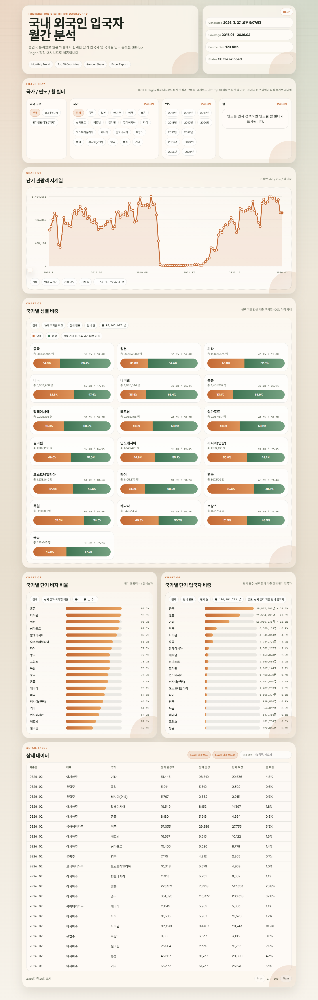

# kresident

## Dashboard Preview



국내 외국인 입국 통계 원본 파일을 수집하고 대시보드로 가공하기 위한 프로젝트다. 현재 기준은 법무부 출입국·외국인정책본부 통계월보 게시판에서 `입국자` 엑셀 첨부를 자동 다운로드하고, 이를 정적 대시보드 dataset으로 변환하는 흐름이다.

## 기술 스택 선택

- `Node.js + TypeScript`를 선택했다.
- 이유 1: 향후 웹 대시보드와 동일한 언어권으로 통합하기 쉽다.
- 이유 2: Node 24의 기본 `fetch`와 `cheerio` 조합으로 게시판 HTML 파싱과 파일 다운로드를 충분히 처리할 수 있다.
- 이유 3: 자동 다운로드 기능을 CLI, 스케줄러, 대시보드 버튼 호출에서 같은 서비스 계층으로 재사용하기 좋다.

## 디렉터리 구조

```text
src/
  app/              # UI/CLI에서 호출할 application service
  cli/              # 수동 실행용 엔트리포인트
  domain/           # 도메인 타입과 계약
  infrastructure/   # HTTP, 파서, 저장소, 파일시스템 구현
data/
  raw/              # 월별 원본 엑셀 저장 위치
  metadata/         # 다운로드 registry와 보조 메타데이터
logs/               # 실행 로그
docs/               # 후속 대시보드 연계 문서
```

## 모듈 경계

- `app`: 다운로드 플로우를 오케스트레이션한다.
- `domain`: 게시글, 첨부파일, 다운로드 기록, 실행 결과 타입을 정의한다.
- `infrastructure`: 게시판 요청, HTML 파싱, 파일 저장, registry 저장을 담당한다.
- `cli`: 지금 단계의 수동 실행 진입점이다.

향후 대시보드는 `app` 계층의 서비스 함수를 직접 호출하고, `cli`는 그 서비스의 얇은 래퍼로 유지한다.

## 환경 설정

`.env.example`에 기본 설정이 들어 있다.

- `BOARD_URL`: 통계월보 게시판 URL
- `RAW_DIR`: 원본 파일 저장 경로
- `METADATA_DIR`: registry 저장 경로
- `LOG_DIR`: 로그 저장 경로
- `REQUEST_TIMEOUT_MS`: 요청 타임아웃
- `REQUEST_RETRY_COUNT`: 재시도 횟수

## 실행

```bash
npm install
npm run dev
```

기본 실행은 신규 파일을 내려받고, 이미 받은 파일은 registry 기준으로 자동 제외한다.

운영 옵션:

```bash
npm run dev
npm run dev -- --dry-run
npm run dev -- --months=3
```

- `--dry-run`: 대상 파일만 계산하고 실제 저장/registry 반영은 하지 않는다.
- `--months=N`: 최신 월보 N건만 대상으로 실행한다.

애플리케이션 서비스는 `runMonthlyDownload(options)` 형태로 분리되어 있어, 향후 스케줄러나 대시보드 버튼이 같은 함수를 직접 호출할 수 있다.

## 검증 결과

2026-03-25 기준 실제 검증:

- 첫 실행에서 대상 월보의 `입국자` 원본 통계표를 다운로드했다.
- 재실행 시 동일 5건은 registry 기준으로 모두 `skipped` 처리됐다.
- 원본 파일은 `data/raw/{yyyy}/{yyyy-mm}/` 경로에 저장되고, 메타데이터는 `data/metadata/download-registry.json`에 기록된다.
- 실행 로그는 `logs/download.log`에 JSON line 형식으로 누적된다.

실패 케이스 확인:

- 잘못된 다운로드 URL을 주입한 테스트에서 결과는 `failed: 1`로 반환됐다.
- 실패한 항목은 registry 성공 건으로 기록되지 않고, 실패 사유만 결과와 로그에 남는다.

## 운영 절차

1. `npm run dev`로 실행한다.
2. 신규 월보가 있으면 파일을 다운로드하고 registry를 갱신한다.
3. 이미 받은 파일이면 다시 받지 않고 `skipped`로 끝난다.
4. 결과 상세는 콘솔 JSON 출력, `data/metadata/download-registry.json`, `logs/download.log`로 확인한다.

## 대시보드 준비 상태

대시보드는 GitHub Pages 정적 퍼블리싱을 전제로 준비한다.

- 집계 규칙 문서: [docs/dashboard-data-rules.md](/C:/Codex/kresident/docs/dashboard-data-rules.md)
- 사용자 확인 필요 항목: [docs/dashboard-open-questions.md](/C:/Codex/kresident/docs/dashboard-open-questions.md)
- 도메인 타입: [src/domain/dashboard.ts](/C:/Codex/kresident/src/domain/dashboard.ts)

현재 기준으로 대시보드는 raw 엑셀을 브라우저에서 직접 읽지 않고, 사전 집계된 dataset JSON을 `site/data` 아래에 생성해 정적 UI가 읽는 구조를 목표로 한다.

## 대시보드 실행

정적 대시보드 산출물 생성:

```bash
npm run generate:dashboard
```

이 명령은 `data/metadata/download-registry.json`과 `data/raw` 원본 파일을 읽어 아래 공개 산출물을 만든다.

- `site/data/dashboard_data.json`
- `site/index.html`
- `site/styles.css`
- `site/app.js`

대시보드 UI는 다음을 포함한다.

- 전체 / B2(무비자) / 단기관광객(B2제외) 입국 구분 필터
- 국가 전체 선택, 연도 멀티 선택, 연도별 월 선택 필터
- 선택 국가군 기준 단기 관광객 시계열 chart와 point hover tooltip
- 단기 관광객 시계열 바로 아래의 full-width 국가별 성별 비중 100% stacked bar
- 국가별 단기 비자 비율 chart
- 선택 필터 기준 전체 단기 입국자를 모수로 하는 국가별 단기 입국자 비중 bar chart
- 국가 검색, 상세 표 페이지네이션
- 현재 필터 결과 기준 Excel 다운로드
- 우측 상단 HELP 버튼과 대시보드 가이드 모달

## GitHub Pages 배포

권장 절차:

1. `npm run generate:dashboard` 실행
2. `site/data/dashboard_data.json`이 최신인지 확인
3. `site/` 정적 파일을 커밋
4. GitHub 저장소 Settings > Pages에서 배포 대상을 `main` branch의 `/site` 또는 GitHub Actions 기반 정적 배포로 설정

참고: GitHub Actions 배포 workflow에서는 raw 원본과 registry 파일이 저장소에 포함되지 않기 때문에 `npm run generate:dashboard`를 CI에서 실행하지 않고, 로컬에서 생성해 커밋한 `site/` 산출물만 배포한다.

현재 구조는 서버가 필요 없는 정적 파일만으로 동작한다.

공개 산출물:

- `site/index.html`
- `site/styles.css`
- `site/app.js`
- `site/data/dashboard_data.json`

비공개/운영 산출물:

- `data/raw/`
- `data/metadata/download-registry.json`
- `logs/download.log`
- `.env`

## 대시보드 검증 메모

2026-03-26 기준:

- `npm run check` 통과
- `npm run generate:dashboard` 통과
- `site/data/dashboard_data.json` 생성 확인
- 집계 결과는 `2013-07`부터 `2026-02`까지 `142개월` 데이터
- 파싱 제외 원본은 `10건`
- 입국 구분 필터, 연도별 월 선택, HELP 모달 반영 확인
- 파싱 제외 10건은 `2025-08` HTML 오류 원본 1건과 `2010-05`, `2008-01~08` 구형 누계 양식 9건

남은 확인 포인트:

- `기타` 국가군을 현재처럼 명시된 18개 국가 외 모든 국가 합산으로 유지할지
- 필요하면 향후 국가군 구성을 사용자가 직접 바꿀 수 있게 할지
